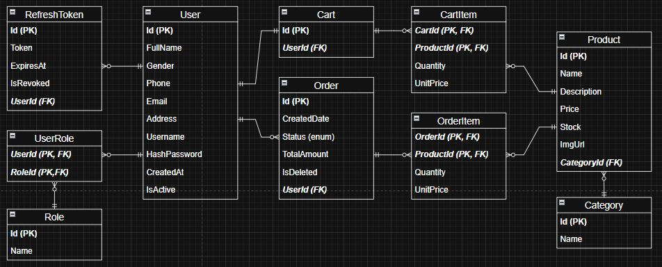

# E-Commerce Backend API (.NET 8)

A RESTful backend API for an e-commerce system built with ASP.NET Core Web API.
This project focuses on clean architecture, authentication, and handling real-world business logic such as cart management and order processing.

---

## 🧰 Tech Stack

- .NET 8, ASP.NET Core Web API  
- Entity Framework Core (DbContext)  
- JWT (access + refresh tokens) with rotation  
- C# async/await for I/O  
- JSON DTOs for API surface  
- SQL Server  

---

## 🏗️ Architecture

- **Controllers (`Controllers/*`)**
  - API surface, request/response mapping  
  - Minimal composition and validation  

- **Services (`Services/*`)**
  - Business logic, orchestration, validation  
  - Transaction boundaries  
  - Only layer calling `DbContext.SaveChangesAsync()`  

- **Repositories (`Repository/*`)**
  - Thin data access layer  
  - Return domain/entities  
  - ❌ Do not call `SaveChanges`  

- **DbContext (`Models/EcommerceDbContext.cs`)**
  - EF Core configuration and relationships  

---

## 🎯 Why Business Logic in Service Layer

- Services own **use-cases and transaction decisions**
- Repositories only expose persistence
- Prevents scattering `SaveChanges` across layers
- Keeps repositories simple and testable

---

## 💾 SaveChanges Responsibility

- `SaveChangesAsync()` is executed **only in Services**
- Allows:
  - Multiple repository operations
  - Single atomic commit

> **Note:** Authentication is separated via `AccountController` + `AccountService`.

---

## 🚀 Features

### 🛒 Cart

- Single cart per user (1–1)
- Add product:
  - Exists → increase quantity in CartItem  
  - Not exists → create new item in CartItem
- Price snapshot:
  - `CartItem` stores price at time of add  

### 📦 Order

- Create order from cart (`CreateOrderFromCart`)
- Maps `CartItems → OrderItems`
- Uses snapshot price + quantity  
- Validates non-empty cart  
- Transactional:
  - Create order  
  - Clear cart after commit  

### 👥 Roles & Users

- Many-to-many: `User ↔ Role` via `UserRole`  
- Role-based authorization via JWT claims  
- Enforced at controller/action level  

### 🔄 Refresh Tokens

- Rotation on every refresh  
- Stored as `RefreshToken` entity  
- Old tokens invalidated  
- Token history retained for:
  - Revocation  
  - Device/session tracking  

---

## 🔐 Authentication

JWT-based authentication:

- Short-lived **access token (Bearer JWT)**  
- Long-lived **refresh token (stored server-side)**  

### Rotation Policy

- Issue new refresh token on each refresh  
- Revoke old token  
- Detect reuse → revoke all tokens  

### Token Validation (Program.cs)

- `ValidateIssuer = true`  
- `ValidateAudience = true`  
- `ValidateIssuerSigningKey = true`  
- `ValidateLifetime = true`  

---

## 🗄️ Database Design


> Entity Relationship Diagram

### Entities

- User  
- Role  
- UserRole  
- Cart  
- CartItem  
- Product  
- Order  
- OrderItem  
- Category  
- RefreshToken  

### Relationships

- User **1–1** Cart  
- User **1–n** Orders  
- User **n–n** Roles (via `UserRole`)  
- Cart **n–n** Products (via `CartItem`)  
- Order **n–n** Products (via `OrderItem`)  
- Product **n–1** Category  
- User **1–n** RefreshTokens  

### Soft Delete

- Entities use `IsActive` flag instead of hard delete  
- Enables auditability and safer deletion semantics  

---

## ⚡ Technical Highlights

- Fully async database access:
  - `FindAsync`, `ToListAsync`, `SaveChangesAsync`,...
- DTOs:
  - Decouple API contract from domain model  
  - Prevent over-posting  
- Lightweight repositories returning aggregates  
- Services:
  - Enforce business rules  
  - Handle DTO mapping  
- Transaction management:
  - Multiple repository operations  
  - Single `SaveChangesAsync()` for atomic commits  
- Refresh token lifecycle:
  - Managed in Service layer  
  - Stored with audit fields  

---

## 🔌 API Endpoints (Representative)

### Authentication

- `POST /api/account/register` — Register user  
- `POST /api/account/login` — Returns `{ accessToken, refreshToken }`  
- `POST /api/account/refresh` — Rotate refresh token  
- `POST /api/account/logout` — Revoke current refresh token(s)  

### Users

- `GET /api/users` — Admin-only user listing  

### Products & Categories

- `GET /api/products` — List products  
- `GET /api/categories` — List categories  

### Cart

- `POST /api/cart/items` — Add/update cart item  
- `GET /api/cart` — View cart  

### Orders

- `POST /api/orders` — Create order from cart  
- `GET /api/orders/{id}` — Retrieve order  

> Controllers: `AccountController`, `UserController`, `ProductController`, `CartController`, `OrderController`, `CategoryController`

---

## ▶️ How to Run

### Prerequisites

- .NET 8 SDK  
- Visual Studio 2022 or .NET CLI  
- Database configured via connection string  

---

### 1. Configuration

Update `appsettings.json`:

- `ConnectionStrings:DefaultConnection`  
- `Jwt:Issuer`  
- `Jwt:Audience`  
- `Jwt:SigningKey`  

### 2. Apply Migrations

```bash id="l0a9v2"
dotnet ef database update --project EcommerceBackend
```
### 3. Run Application

```bash
dotnet build
dotnet run --project EcommerceBackend
```
---

## 📝 Notes

- Transactional boundaries are explicit: services are the unit-of-work owners and call SaveChangesAsync().
- Business-critical rules live in service layer (cart quantity merge, price snapshot, order mapping, token rotation, role management) — enabling clean unit testing and clear responsibility separation.
- Code is organized to support integration tests and policy-driven authorization tests without database-side side-effects (soft delete and token revocation tracked in DB).
